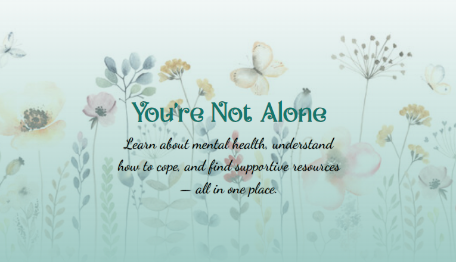
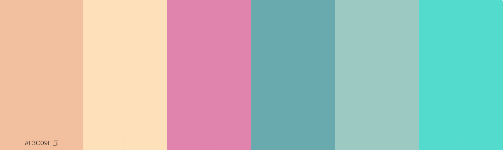

<h1 align="center">Mind Garden</h1>

## Project Overview

**Mind Garden** is a calming, accessible one-page website created to raise awareness about mental health. It is designed using **HTML**, **CSS**, and **Bootstrap**, with an emphasis on UX design principles, accessibility, responsiveness, and user engagement through smooth transitions and interactive modals.

---

## Purpose

This project was developed to:
- Provide accessible, beginner-friendly information on mental health.
- Present content in a supportive, well-organized, and calming layout.
- Practice front-end web development using modern **HTML** and **CSS** techniques and frameworks like Bootstrap.
- Apply UX and accessibility principles.

## Ux Design
### **User Stories**
### Topic Clarity
- As a first-time **USER**
I want to easily find information on common mental health issues, so that I can quickly understand if any relate to what I'm experiencing.
- **Acceptance Criteria**
  * The homepage includes clearly labeled sections for at least 3 common topics (e.g., stress, anxiety, depression).

  * Each topic is previewed with a short description and “Learn more” link.

  * Content uses plain, non-clinical language.

### Calming User Experience
- As a **USER** who feels overwhelmed, I want the site to use calming colors and easy-to-read text, so that I don’t feel more anxious while reading.

- **Acceptance Criteria**
  * Background uses soft tones (e.g., pastel blue/green).
  * Body text is at least 16px and uses a readable font.
  * Content blocks are visually separated with padding and whitespace.

### Easy Navigation
- As a mobile **User**, I want to navigate the site easily on my phone , so that I can access information wherever I am without frustration.

- **Acceptance Criteria**
  * The layout is responsive on small screens.
  * The navigation bar collapses into a mobile menu using Bootstrap.

### Organized Layout
- As a **SITE OWNER**, I want to use Bootstrap to structure content in cards and grids, so that the page feels clean, professional, and easy to maintain.

- **Acceptance Criteria**
  * Topics are displayed using Bootstrap card components.
  * The page uses the Bootstrap grid system 
  * Code is organized with semantic HTML5 structure (<'section'>, <'main'>)

## Color Design

- I used calm pastel colours so that the user is not overwhelmed when interacting with my website
- The colours I picked also match my theme of "Mind Garden"
- Heres the link to my palette https://www.figma.com/color-palettes/gentle-dunes/

## Fonts
- I used a mixture of google fonts and speacial downloaded fonts I found myself on https://www.1001fonts.com/
- I also made sure I used back up fonts to fail proof against differnt webpages

## Ai Utilisation 
- Created a Nav bar and used Ai to help format it better
- Check user stories

